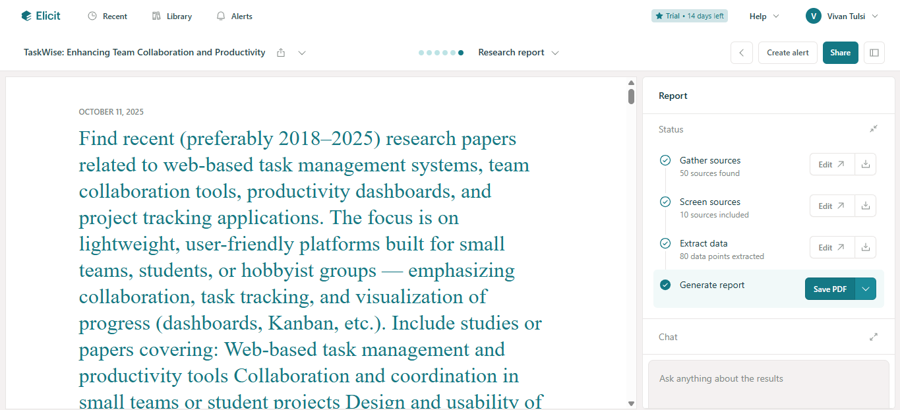
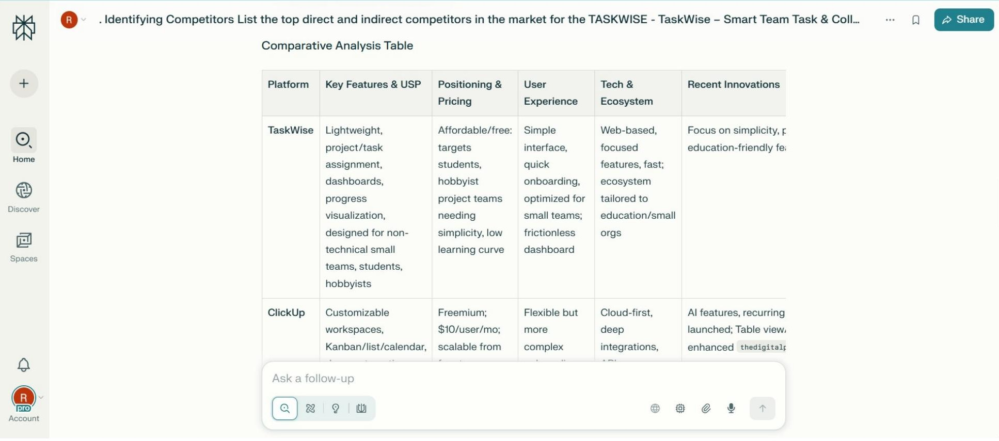
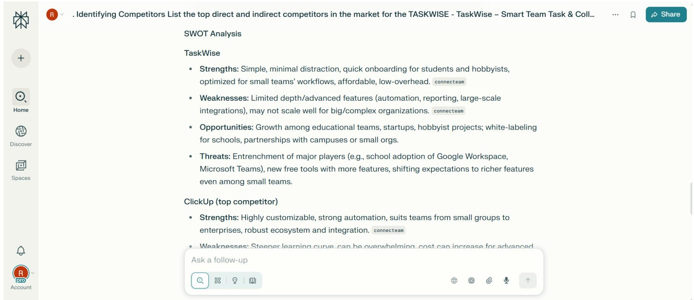
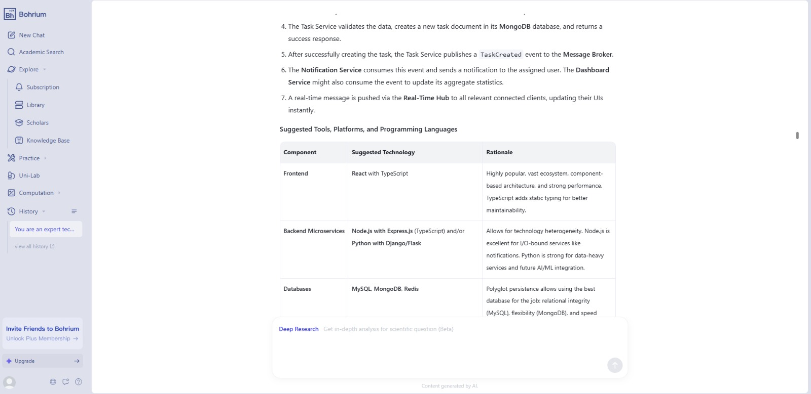
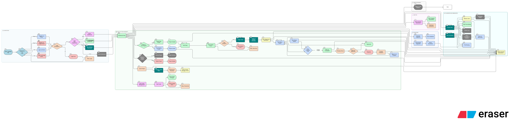
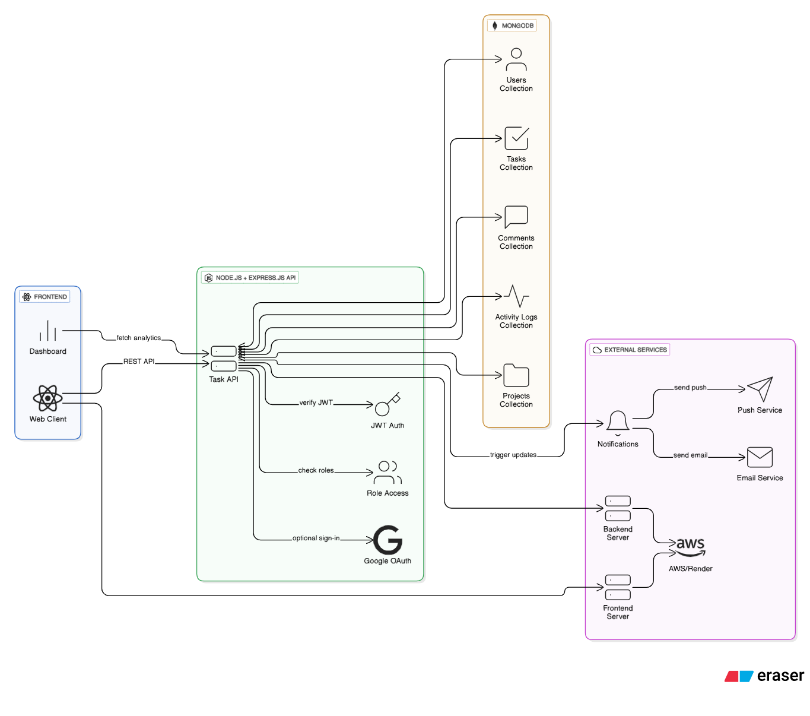
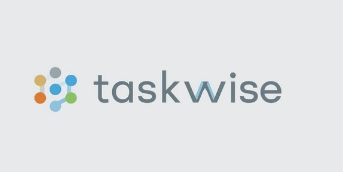
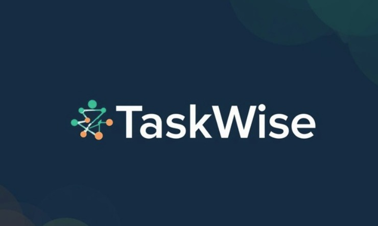

# Project Development Blueprint using AI

This repository is intended for participants who will learn how to use AI tools for **ideation, design, architecture, prototyping, and technical implementation** — all through a single case study project.


> ⚠️ **WARNING**
>
> All project outputs (code, designs, reports, etc.) were **generated with AI assistance** and may contain **inaccuracies, logical errors, security vulnerabilities, or ethical biases**. This blueprint is for demonstration and learning; outputs **require human review, validation, and correction** before being used in a production environment.


## Table of Contents

- [Case Study](#case-study)
    - [Key Features](#key-features)
- [Phase - 0 : Planning](#phase---0--planning)
    - [Ideation and Research](#ideation-and-research)
        - [Notion AI](#tool-1--notion-ai)
        - [Elicit](#tool-2--elicit)
        - [Perplexity](#tool-3--perplexity)
- [Phase - 1 : Requirements Analysis](#phase---1--requirements-analysis)
    - [Bohrium AI](#tool-4--bohrium-ai)
- [Phase - 2 : Design](#phase---2--design)
    - [Eraser.io](#tool-5--eraserio)
    - [Lucidchart](#tool-6--lucidchart)
    - [Miro](#tool-7--micro)
    - [Figma](#tool-8--figma)
    - [REWEB](#tool-9--reweb)
    - [Stitch AI](#tool-10--stitch-ai)
- [Phase - 3 : Coding](#phase---3--coding)
    - [GitHub AI Copilot](#tool-11--github-ai-copilot)
- [Acknowledgements](#acknowledgements)
- [Contributions](#contributions)

## Case Study

> ### TaskWise – Smart Team Task & Collaboration Manager
> Concept : TaskWise is a lightweight team task management web application designed for students, small teams, and hobbyist projects.  
> It helps users efficiently organize and track their work through an intuitive interface.  
> #### Key Features  
> - Create, assign, and track tasks  
> - Organize work within projects or groups  
> - Visualize task progress through dashboards and task lists  

# Phase - 0 : Planning

Planning, involves defining the project's purpose and scope, much like pinpointing our destination and plotting the best route. We uncover the tasks at hand during this phase and strategize for efficient execution. [[1]](#acknowledgements)

## Ideation and Research

Each tool was provided with a structured prompt template to ensure consistent outputs across the ideation and research phase.

### Tool 1 : [Notion AI](https://www.notion.so/help/guides/category/ai)

Notion AI was used to generate the **Technical Research Report** for the project case study.

- [Prompt Template (.txt)](prompts/notion_ai_prompt.txt)  
- [Generated Output (.md)](outputs/notion_ai_output.md)

> [General Prompt Template for Technical Research](general_prompts/bohrium_general_prompt.txt)

### Tool 2 : [Elicit](https://elicit.com/)

Elicit was used to generate **Literature Review** for the project case study.

- [Prompt Template (.txt)](prompts/elicit_prompt.txt)



- [Generated Output (.pdf)](outputs/elicit_output.pdf)

> [General Prompt Template for Literature Review](general_prompts/elicit_general_prompt.txt)


### Tool 3 : [Perplexity](https://www.perplexity.ai/)

Perplexity AI was used for **market research** for the project case study.

- [Prompt Template (.txt)](prompts/perplexity_prompt.txt)





> [General Prompt Template for Market Research](general_prompts/perplexity_general_prompt.txt)


# Phase - 1 : Requirements Analysis

Requirements Analysis, seeks to identify and record the precise requirements of the final users. In this phase, the team is looking to answer, **"What are the expectations of our users from our software?"** This is called requirements gathering. [[1]](#acknowledgements)


### Tool 4 : [Bohrium AI](https://www.bohrium.com/)

Bohrium AI was used with the same prompt provided to Notion AI and generated the complete **Software Requirements Specification (SRS) document** for the project.

- [Prompt Template (.txt)](prompts/bohrium_prompt.txt)



- [Generated Comprehensive Output (.txt)](outputs/bohrium_output.txt)

> [General Prompt Template for SRS](general_prompts/bohrium_general_prompt.txt)


# Phase - 2 : Design

The emphasis lies on outlining the software's structure, navigation, user interfaces, and database design. This phase ensures that the software is user-friendly and performs its tasks efficiently.

So, what tasks does the team undertake? Key activities include crafting data flow diagrams, constructing entity-relationship diagrams, and designing user interface mock-ups. [[1]](#acknowledgements)


### Tool 5 : [Eraser.io](https://www.eraser.io/ai)

Eraser.io was used for **Visuals / Diagrams** for the project case study.

Here we have used different tools but same template:

- [Userflow Diagram Prompt Template (.txt)](prompts/prompt_userflow.txt)
- [Architecture Diagram Prompt Template (.txt)](prompts/prompt_architecture.txt)

**User Flow Diagram** 



**Architecture Diagram**  



### Tool 6 : [Lucidchart](https://www.lucidchart.com/pages/use-cases/diagram-with-AI)

- [Userflow Diagram (.png)](outputs/lucidchart_output_userflow.png)

  
- [Architecture Diagram (.png)](outputs/lucidchart_output_architecture.png)

### Tool 7 : [Micro](https://miro.com/ai/flowchart-ai/)
 
- [Userflow Diagram (.jpg)](outputs/miro_output_userflow.jpg)

- [Architecture Diagram (.jpg)](outputs/miro_output_architecture.jpg)


> [General User Flow Diagram Prompt Template](general_prompts/general_prompt_userflow.txt)

> [General Architecture Diagram Prompt Template](general_prompts/general_prompt_architecture.txt)

### Tool 8 : [Figma](https://www.figma.com/make)

- [Prompt 1 – Figma Prototype Design](prompts/figma_prompt_1.txt)
    - Used to generate a **visual prototype** of TaskWise, including key screens such as Dashboard, Task Creation, Task Tracking, Projects/Groups, Profile, and Analytics. The output defines the **layout, navigation, responsiveness, colors, fonts, and icons** for desktop, tablet, and mobile.

- [Output 1 - Figma Prototype Design](https://www.figma.com/make/yPYjilfEqzQ9z35UQUCv7H/Smart-Team-Task-Manager?fullscreen=1)

- [Prompt 2 – Figma Prototype Design](prompts/figma_prompt_2.txt)
    - Used to produce **detailed functional specifications and UI/UX rules** for TaskWise. It outlines task creation, assignment, tracking, project organization, dashboards, and responsive behavior, along with **color palettes, typography, icon usage, and layout guidelines** for consistent implementation.

- [Output 2 – Figma Prototype Design](https://www.figma.com/make/ZgA4ZZbGVbVZQk2Q9O2JkO/Smart-Team-Task-Manager?fullscreen=1)

> [General Prompt Template](general_prompts/figma_general_prompt.txt)


### Tool 9 : [REWEB](https://reweb.so/)

- [Prompt 1 - REWEB Prototype Design](prompts/reweb_prompt_1.txt)
    - This prompt is focused on creating a **high-fidelity Figma prototype** for TaskWise. It defines key screens, layout, design style, color palette, fonts, and responsiveness. The goal is to guide a designer or AI to produce an **interactive, visually consistent, and intuitive prototype** that allows users to **create, assign, track, and visualize tasks** across devices. Essentially, it’s about **UI/UX prototyping** for the app.

- [Output 1 - REWEB Prototype Design](https://www.figma.com/design/31PzKtkvcO5A605X2kfwgK/Untitled?node-id=6-3&t=UZHUtSQRrJJ8MHoD-1)

- [Prompt 2 -  REWEB Prototype Design](prompts/reweb_prompt_2.txt)
    - This prompt is similar to Prompt 1 but goes deeper into **functional UI elements and user interactions**. It specifies detailed components for each screen, such as **forms, task cards, Kanban boards, dashboards, reports, and navigation**. It also describes mobile responsiveness, touch-friendly interactions, smooth transitions, alerts, accessibility considerations, and usability enhancements. The goal here is to generate a **fully functional, modern web app UI concept** that clearly shows how users interact with TaskWise, not just how it looks.

- [Output 2 - REWEB Prototype Design](https://www.figma.com/design/D01L4xp1kR8uV1VGFCqPlI/Untitled?node-id=0-1&t=zW16e3Nj50rNTqJ0-1)

> [General Prompt Template](general_prompts/reweb_general_prompt.txt)


### Tool 10 : [Stitch AI](https://stitch.withgoogle.com/)

- [Prompt 1 – Stitch Prototype Design](prompts/stitch_prompt_1.txt)
    - Designs a clean, responsive prototype for TaskWise, covering all key screens (dashboard, task creation, tracking, projects, profile, analytics) with a modern, minimal style and specific color/font guidelines. The goal is to deliver an intuitive prototype for efficient team task management.

- [Output 1 – Stitch Project](https://stitch.withgoogle.com/projects/16760712255908790618)

- [Prompt 2 – Stitch Prototype Design](prompts/stitch_prompt_2.txt)
	- Focuses on the core functional requirements for TaskWise, detailing UI/UX for task creation, assignment, tracking, project organization, dashboards, and responsive layouts. It emphasizes usability, real-time updates, and productivity-focused design.
- [Output 2 – Stitch Project](https://stitch.withgoogle.com/projects/15084347206591437648)

> [General Prompt Template](general_prompts/stitch_general_prompt.txt)

### Tool 11 : [Canva AI](https://www.canva.com/ai-logo-generator/)

The process of creating a unique visual symbol or icon that represents the project’s identity, values, and brand.

[Logo Prompt Template](prompts/canva_prompt.txt)


**Outputs**




> [General Prompt Template](general_prompts/canva_general_prompt.txt)

# Phase - 3 : Coding & Documentation

This development phase aims to develop software that is functional, efficient, and user-friendly. Developers use an appropriate programming language, Java or otherwise, to write the code, guided by the SDD and coding guidelines. This document, acting as a roadmap, ensures the software aligns with the vision set in earlier phases. [[1]](#acknowledgements)

### Tool 12 : [GitHub AI Copilot](https://github.com/features/copilot)


With minimal prompting and concise instructions about our project, **GitHub AI Copilot** was able to generate functional and well-structured code for **TaskWise**. The AI assisted in implementing core features such as **task creation, assignment, tracking, and project organization**, while also adhering to best practices in **readability, modularity, and maintainability**. This significantly accelerated the development process, allowing the team to focus on **refining the user experience** and integrating additional functionalities.

#### PROMPT 1
This prompt is used to instruct AI to create the entire TaskWise project while ensuring a consistent tech stack and complete functionality:

```
"Develop a comprehensive, end-to-end product using AI tools, specifically GitHub Copilot and other development AI tools, for the Case Study: 

TaskWise – Smart Team Task & Collaboration Manager. The goal is to create a lightweight team task management web application for students, small teams, or hobbyist projects.

**Task Requirements:** 
1. Design and implement the frontend and backend locally, ensuring seamless integration. 
2. Utilize a fixed tech stack (to be determined) for consistency throughout the project. 
3. Develop a user-friendly interface for creating, assigning, and tracking tasks. 
4. Implement features for organizing work within projects or groups. 
5. Create dashboards and lists for visualizing task progress. 

**Prompt for Frontend Development:** 
Using the chosen tech stack, design and build the frontend of TaskWise, focusing on a responsive and intuitive user interface. Ensure the following features are implemented: 
- User authentication and authorization 
- Task creation, assignment, and tracking 
- Project and group organization 
- Dashboard and list views for task progress 

**Prompt for Backend Development:** 
Develop the backend of TaskWise using the selected tech stack, focusing on a scalable and secure architecture. Ensure the following features are implemented: 
- User authentication and authorization 
- Task management (creation, assignment, tracking) - Project and group management 
- Data storage and retrieval for task progress 

**Integration Requirements:** 
Ensure seamless integration between the frontend and backend, using APIs or other suitable technologies. Implement data validation, error handling, and security measures to protect user data. 

**Tech Stack Selection:** 
Choose a suitable tech stack for the project, considering factors such as scalability, security, and ease of development. Some options to consider include: 
- Frontend: React, Angular, or Vue.js 
- Backend: Node.js, Django, or Flask 
- Database: MongoDB, PostgreSQL, or MySQL 

Provide a detailed explanation for the chosen tech stack and ensure it is used consistently throughout the project."
```

#### PROMPT 2

This prompt helps students ideate and integrate AI-powered features (like smart task suggestions, team productivity analytics, or sentiment-based collaboration) into their project to make it more innovative and industry-relevant:

```
Identify a unique and innovative feature that can be integrated into the solution project to make it applicable and beneficial in real-world scenarios, addressing a specific real-world problem. Consider incorporating Artificial Intelligence (AI) elements, as they are increasingly prevalent in modern projects. Outline the potential AI components and their functionalities, ensuring they enhance the project's usability and effectiveness in solving the targeted problem. Provide a clear explanation of how the proposed feature and AI integration will contribute to the project's real-world applicability and value.
```

#### PROMPT 3
This prompt is used to improve the design, UI, and user experience of the project — making the website more professional, interactive, and visually appealing:

```
Enhance the website's aesthetic appeal to align with professional industry standards, ensuring a user-friendly interface that minimizes ambiguity. Implement the following improvements: 
1. **Visual Design**: Select a theme and color scheme that is visually appealing and consistent throughout the website. 
2. **Typography and Text**: Ensure all text is clear, concise, and properly formatted, using headings and subheadings as necessary for readability. 
3. **Effects and Animations**: Apply effects and animations judiciously to enhance the user experience without overwhelming the user. 
4. **User Interface Clarity**: Ensure that all elements, including buttons, menus, and interactive components, are intuitive and clearly labeled to prevent user confusion.
5. **Consistency**: Maintain consistency in design elements throughout the website to create a cohesive and professional appearance. 
6. **Usability Testing**: Conduct usability testing to identify and address any areas of ambiguity or difficulty in the user experience.
```
- [Output – Backend Code](code/TaskWise/backend/)
- [Output – Frontend Code](code/TaskWise/frontend/)

---

# Acknowledgements

1. [The Seven Phases of the Software Development Life Cycle, Harness](https://www.harness.io/blog/software-development-life-cycle-phases)

# Contributions

[Neelkanth Khithani](https://github.com/Neelkanth-khithani), [Kedaar Kate](https://github.com/KedaarK), [Manish Raje](https://github.com/manishraje28/), [Vivan Tulsi](https://github.com/Vivan1611/), [Taha Sayyed](https://github.com/786-sys), [Jaee Sakharkar](https://github.com/JaeeSakharkar), [Sanskruti Ukarande](https://github.com/sanskrutiuk), [Riddhi Motwani](https://github.com/riddhimotwani), [Mahek Hingorani](https://github.com/Mahek2710), Amogh More